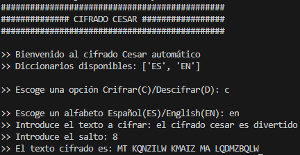
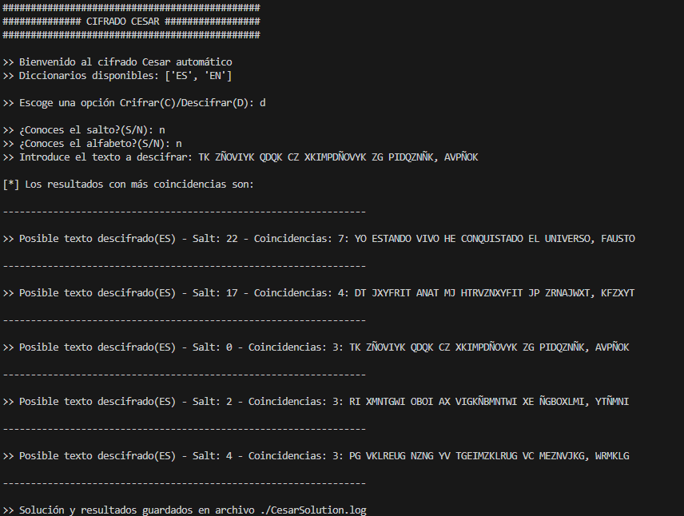

# 🔐 Cifrado César Automático (Español / Inglés)

Este proyecto implementa un script en Python que permite **cifrar** texto utilizando el clásico **cifrado César**, y además **descifrar automáticamente** sin conocer el salto ni el alfabeto.  
El sistema detecta el idioma más probable comparando el resultado con diccionarios de palabras en **español** e **inglés**.


---

## 🚀 Características

- 🔠 Cifrado César personalizado con alfabeto español o inglés (incluye `ñ`).
- 🧠 Descifrado automático sin necesidad de conocer el salto ni el idioma.
- 🧾 Comparación inteligente con diccionarios reales (`diccES.txt`, `diccEN.txt`).
- 📄 Resultados detallados guardados automáticamente en `CesarSolution.log`.
- ✅ Compatible con Python 3.x.

---

## 📁 Archivos necesarios

Asegurate de tener en el mismo directorio:

- `Cesar.py` – script principal.
- `diccES.txt` – listado de palabras en español (una por línea).
- `diccEN.txt` – listado de palabras en inglés (una por línea).

---

## 📦 Requisitos

- Python 3.x

---

## ▶️ Uso

Ejecutá el script desde terminal:

```bash
python Cesar.py
```

```bash
>> Escoge una opción Crifrar(C)/Descifrar(D):
```

---

## 🔐 Cifrado
- Elegís el alfabeto: Español (ES) o Inglés (EN).

- Ingresás el texto a cifrar.

- Definís el salto deseado.

- El resultado se muestra en pantalla.



## 🔓 Descifrado Automático
- El script pregunta si conocés el salto.

- Luego pregunta si conocés el alfabeto.

- Si no sabés ninguno, intenta todas las combinaciones posibles.

- Muestra los resultados más probables con coincidencias léxicas.

- Guarda el log completo en CesarSolution.log.



## 🧠 Cómo funciona el descifrado
- El script prueba todas las rotaciones posibles en ambos alfabetos.

- Cuenta cuántas palabras coinciden con los diccionarios.

- Ordena los resultados por número de coincidencias.

- Muestra las 5 mejores opciones encontradas.

```bash

>> Escoge una opción Crifrar(C)/Descifrar(D): D

>> ¿Conoces el salto?(S/N): N
>> ¿Conoces el alfabeto?(S/N): N
>> Introduce el texto a descifrar: KHOOR ZRUOG

[*] Los resultados con más coincidencias son:

>> Posible texto descifrado(EN) - Salt: 3 - Coincidencias: 2: HELLO WORLD
```

## 📄 Salida de resultados
Todos los posibles resultados, incluyendo coincidencias y configuraciones probadas, se guardan automáticamente en un archivo llamado **CesarSolution.log**

## 🧑‍💻 Autor
Desarrollado por [Alejandro Molinos Eligio](https://github.com/AlejandroMolinosEligio)
Proyecto educativo de criptografía clásica y procesamiento de texto.